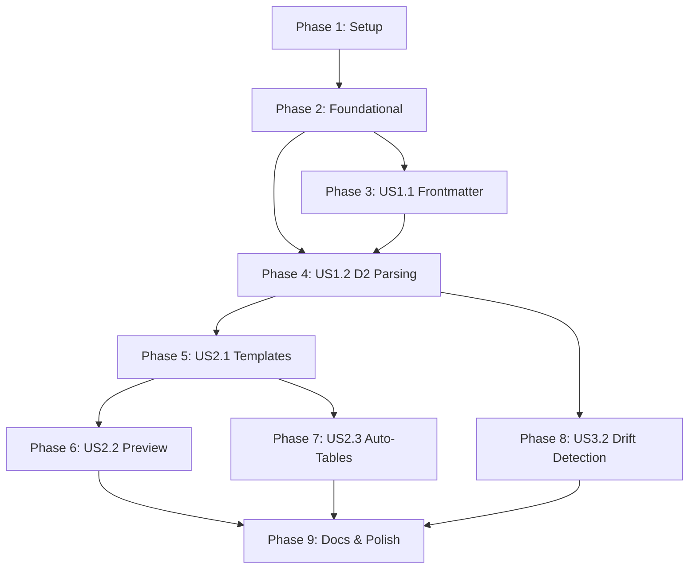

# Task Breakdown: UX Improvements from Real-World Feedback

**Feature**: 007-ux-improvements  
**Branch**: `007-ux-improvements`  
**Date**: 2026-02-13  
**Status**: Ready for implementation

---

## Overview

This document breaks down the implementation of UX improvements into concrete, executable tasks organized by user story for independent implementation and testing.

**Implementation Strategy**: TDD approach with test-first development. Each user story is independently testable and deliverable.

**Key Metrics**:
- Total Tasks: 69
- User Stories: 6 (3 P1, 1 P2)
- Test Tasks: 26 (unit + integration)
- Implementation Tasks: 43
- Estimated Time: 14-20 hours

---

## Task Organization

### User Story Mapping

| Phase | User Story | Epic | Priority | Tasks | Status |
|-------|-----------|------|----------|-------|--------|
| Phase 3 | US1.1: Parse Frontmatter Relationships | Epic 1 | P1 | T012-T019 | Pending |
| Phase 4 | US1.2: Parse D2 Relationships | Epic 1 | P1 | T020-T031 | Pending |
| Phase 5 | US2.1: Template Selection by Technology | Epic 2 | P1 | T032-T048 | Pending |
| Phase 6 | US2.2: D2 Diagram Preview | Epic 2 | P2 | T049-T055 | Pending |
| Phase 7 | US2.3: Auto-Generated Component Lists | Epic 2 | P2 | T056-T062 | Pending |
| Phase 8 | US3.2: Drift Detection | Epic 3 | P2 | T063-T069 | Pending |

**Note**: User Story 1.3 (Relationship CRUD Tools) and 3.1 (Source of Truth docs) are deferred to future releases per spec.

---

## Phase 1: Setup & Dependencies

**Goal**: Install D2 parsing libraries and prepare project structure

**Independent Test Criteria**: `go mod tidy` succeeds, `go build ./...` succeeds

### Dependency Installation

- [X] T001 Add D2 parsing library dependencies in go.mod (`oss.terrastruct.com/d2`)
- [X] T002 Run `go mod download` to install D2 libraries
- [X] T003 Verify D2 library integration with basic import test in internal/adapters/d2/

### Project Structure

- [X] T004 Create internal/core/entities/d2_relationship.go file structure
- [X] T005 Create internal/core/entities/template_selector.go file structure
- [X] T006 Create internal/core/entities/drift_issue.go file structure
- [X] T007 Create internal/adapters/d2/parser.go file structure
- [X] T008 Create internal/adapters/ason/template_registry.go file structure
- [X] T009 Create templates/component/ directory for 7 template files
- [X] T010 Create internal/core/usecases/detect_drift.go file structure
- [X] T011 Create test directories: tests/integration/, tests/unit/

---

## Phase 2: Foundational Components

**Goal**: Implement core entities and interfaces that block all user stories

**Independent Test Criteria**: All entity constructors validate inputs, all tests pass

### Core Entities (Blocking Prerequisites)

- [X] T012 [P] Implement D2Relationship entity with NewD2Relationship() constructor and Key() method in internal/core/entities/d2_relationship.go
- [X] T013 [P] Implement TemplateType enum with String() method and SelectTemplate() function in internal/core/entities/template_selector.go
- [X] T014 [P] Implement DriftIssue entity with NewDriftIssue() constructor in internal/core/entities/drift_issue.go
- [X] T015 [P] Add D2Parser interface to internal/core/usecases/ports.go
- [X] T016 [P] Add TemplateRegistry interface to internal/core/usecases/ports.go

### Entity Tests

- [X] T017 [P] Unit test D2Relationship validation (5 cases: valid, empty source, empty target, Key() method, empty label) in tests/unit/d2_relationship_test.go
- [X] T018 [P] Unit test TemplateType enum (7 cases: String() for each type + SelectTemplate() pattern matching) in tests/unit/template_selector_test.go
- [X] T019 [P] Unit test DriftIssue severity assignment (3 cases: description mismatch=WARNING, missing component=ERROR, orphaned relationship=ERROR) in tests/unit/drift_issue_test.go

---

## Phase 3: User Story 1.1 - Parse Frontmatter Relationships

**Goal**: Parse relationships from component frontmatter into architecture graph

**Independent Test Criteria**: 
- `find_relationships` MCP tool returns non-empty results for test components with frontmatter relationships
- Graph edges contain relationships from frontmatter

### Tests First (TDD)

- [X] T020 [US1.1] Unit test: frontmatter relationship parsing (5 cases: none, single, multiple, invalid path, circular) in internal/adapters/filesystem/project_repo_test.go
- [X] T021 [US1.1] Unit test: BuildArchitectureGraph creates edges from frontmatter relationships (3 cases: single component, multiple components, deduplicate) in internal/core/usecases/build_architecture_graph_test.go
- [X] T022 [US1.1] Integration test: create component with frontmatter relationships, verify graph has edges in tests/integration/relationship_parsing_test.go

### Implementation

- [X] T023 [US1.1] Enhance ProjectRepository.LoadComponent() to parse relationships map from frontmatter in internal/adapters/filesystem/project_repo.go (line 917)
- [X] T024 [US1.1] Update BuildArchitectureGraph use case to iterate component relationships and create graph edges in internal/core/usecases/build_architecture_graph.go
- [X] T025 [US1.1] Verify find_relationships MCP tool returns populated results (no code changes, graph now has data) in internal/mcp/tools/find_relationships.go

### Verification

- [X] T026 [US1.1] Run integration test to verify find_relationships returns results for test project
- [X] T027 [US1.1] Run integration test to verify query_dependencies shows graph connections

---

## Phase 4: User Story 1.2 - Parse D2 Relationships

**Goal**: Parse relationship arrows from D2 files into architecture graph with union merge

**Independent Test Criteria**:
- D2 parser extracts arrows from test D2 files
- Graph merges frontmatter + D2 relationships (deduplicate by source+target+type)
- Parse errors skip file with warning, continue with other files

### Tests First (TDD)

- [ ] T028 [US1.2] Unit test: D2Parser.ParseRelationships() (7 cases: single arrow, multiple arrows, unlabeled arrow, empty file, invalid syntax error, multi-target, nested shapes) in internal/adapters/d2/parser_test.go
- [ ] T029 [US1.2] Unit test: Union merge logic (4 cases: frontmatter only, D2 only, both same type deduplicated, both different types keep both) in internal/core/usecases/build_architecture_graph_test.go
- [ ] T030 [US1.2] Integration test: component with frontmatter + D2 relationships, verify graph has edges from both sources in tests/integration/relationship_parsing_test.go
- [ ] T031 [US1.2] Integration test: D2 parse error handling (malformed D2 file skipped with warning) in tests/integration/relationship_parsing_test.go

### Implementation

- [ ] T032 [P] [US1.2] Implement D2Parser adapter using oss.terrastruct.com/d2 library in internal/adapters/d2/parser.go
- [ ] T033 [US1.2] Implement graceful degradation: catch parse errors, log warning, return empty slice in internal/adapters/d2/parser.go
- [ ] T034 [US1.2] Wire D2Parser to BuildArchitectureGraph use case (inject via constructor) in internal/core/usecases/build_architecture_graph.go
- [ ] T035 [US1.2] Implement union merge logic: parse D2 files for each component, extract relationships, merge with frontmatter in internal/core/usecases/build_architecture_graph.go
- [ ] T036 [US1.2] Implement deduplication by (source, target, type) tuple in internal/core/usecases/build_architecture_graph.go

### Performance Optimization

- [ ] T037 [P] [US1.2] Add worker pool pattern for concurrent D2 file parsing (10 workers) in internal/core/usecases/build_architecture_graph.go
- [ ] T038 [P] [US1.2] Benchmark test: verify 100 components parse in <200ms in tests/benchmarks/d2_parsing_bench_test.go

### Verification

- [ ] T039 [US1.2] Run integration test: verify D2 arrows appear in graph
- [ ] T040 [US1.2] Run integration test: verify union merge deduplicates correctly
- [ ] T041 [US1.2] Verify analyze_coupling MCP tool provides metrics (graph now has complete data)

---

## Phase 5: User Story 2.1 - Template Selection by Technology

**Goal**: Auto-select component templates based on technology field with 7 template types

**Independent Test Criteria**:
- `loko new component --technology "DynamoDB"` creates component with datastore template
- `loko new component --template datastore` overrides pattern matching
- All 7 templates exist and are valid

### Tests First (TDD)

- [ ] T042 [US2.1] Unit test: SelectTemplate() pattern matching (9 cases: 7 template types + override flag + unknown fallback to generic) in tests/unit/template_selector_test.go
- [ ] T043 [US2.1] Unit test: TemplateRegistry.GetTemplatePath() (8 cases: 7 template types + missing template error) in internal/adapters/ason/template_registry_test.go
- [ ] T044 [US2.1] Integration test: create DynamoDB component, verify datastore template sections in tests/integration/template_selection_test.go
- [ ] T045 [US2.1] Integration test: create Lambda component, verify compute template sections in tests/integration/template_selection_test.go
- [ ] T046 [US2.1] Integration test: override with --template flag, verify correct template used in tests/integration/template_selection_test.go

### Template Files

- [ ] T047 [P] [US2.1] Create compute.md template (Lambda, Functions) in templates/component/compute.md
- [ ] T048 [P] [US2.1] Create datastore.md template (DynamoDB, RDS) in templates/component/datastore.md
- [ ] T049 [P] [US2.1] Create messaging.md template (SQS, SNS, Kinesis) in templates/component/messaging.md
- [ ] T050 [P] [US2.1] Create api.md template (API Gateway, REST) in templates/component/api.md
- [ ] T051 [P] [US2.1] Create event.md template (EventBridge, Step Functions) in templates/component/event.md
- [ ] T052 [P] [US2.1] Create storage.md template (S3, EFS) in templates/component/storage.md
- [ ] T053 [P] [US2.1] Create generic.md template (unknown technology fallback) in templates/component/generic.md

### Implementation

- [ ] T054 [US2.1] Implement TemplateRegistry adapter with GetTemplatePath() and ValidateTemplate() methods in internal/adapters/ason/template_registry.go
- [ ] T055 [US2.1] Enhance CreateComponent use case to call SelectTemplate() and inject TemplateRegistry in internal/core/usecases/create_component.go
- [ ] T056 [US2.1] Add --template flag to `loko new component` command for override in cmd/new.go
- [ ] T057 [US2.1] Wire TemplateRegistry to CreateComponent use case in main.go

### Verification

- [ ] T058 [US2.1] Run integration test: create 7 components (one per template type), verify each has correct template
- [ ] T059 [US2.1] Verify DynamoDB components have 0 irrelevant "Public Methods" sections
- [ ] T060 [US2.1] Verify Lambda components have relevant compute sections (trigger, runtime, timeout)

---

## Phase 6: User Story 2.2 - D2 Diagram Preview

**Goal**: Render D2 diagram preview during component creation

**Independent Test Criteria**:
- `loko new component --preview` displays rendered D2 diagram
- MCP create_component tool returns diagram preview in response

### Tests First (TDD)

- [ ] T061 [US2.2] Unit test: RenderDiagramPreview() (3 cases: valid D2 returns SVG/ASCII, empty D2 returns empty, invalid D2 returns error) in internal/core/usecases/render_diagram_preview_test.go
- [ ] T062 [US2.2] Integration test: create component with --preview, verify output contains diagram in tests/integration/template_selection_test.go

### Implementation

- [ ] T063 [P] [US2.2] Create RenderDiagramPreview use case (calls d2 CLI with --sketch flag) in internal/core/usecases/render_diagram_preview.go
- [ ] T064 [US2.2] Implement ASCII preview renderer in internal/adapters/d2/preview_renderer.go
- [ ] T065 [US2.2] Add --preview flag to `loko new component` command in cmd/new.go
- [ ] T066 [US2.2] Enhance MCP create_component tool to call RenderDiagramPreview and include in response in internal/mcp/tools/create_component.go

### Verification

- [ ] T067 [US2.2] Run integration test: verify preview shows component position in container diagram

---

## Phase 7: User Story 2.3 - Auto-Generated Component Lists

**Goal**: Auto-populate component/container tables in documentation

**Independent Test Criteria**:
- `loko build_docs` regenerates component tables in container.md
- Tables include Name, Technology, Description from frontmatter
- Manual "Notes" section preserved

### Tests First (TDD)

- [ ] T068 [US2.3] Unit test: GenerateComponentTable() (4 cases: empty container, single component, multiple components, include Name+Technology+Description) in internal/core/usecases/build_docs_test.go
- [ ] T069 [US2.3] Integration test: build docs, verify container.md has component table in tests/integration/template_selection_test.go

### Implementation

- [ ] T070 [P] [US2.3] Implement GenerateComponentTable() helper function in internal/core/usecases/build_docs.go
- [ ] T071 [P] [US2.3] Implement GenerateContainerTable() helper function in internal/core/usecases/build_docs.go
- [ ] T072 [US2.3] Update container.md template with {{component_table}} placeholder in templates/container/default.md
- [ ] T073 [US2.3] Update system.md template with {{container_table}} placeholder in templates/system/default.md
- [ ] T074 [US2.3] Wire table generation into build_docs use case in internal/core/usecases/build_docs.go

### Verification

- [ ] T075 [US2.3] Run integration test: verify tables auto-populate with correct data
- [ ] T076 [US2.3] Verify manual "Notes" section preserved after regeneration

---

## Phase 8: User Story 3.2 - Drift Detection

**Goal**: Detect inconsistencies between D2 and frontmatter with severity levels

**Independent Test Criteria**:
- `loko validate --check-drift` reports description mismatches (WARNING)
- Reports missing components in D2 (ERROR)
- Reports orphaned relationships in frontmatter (ERROR)
- Exit code 1 for errors, 0 for warnings only

### Tests First (TDD)

- [ ] T077 [US3.2] Unit test: DetectDrift() (5 cases: no drift, description mismatch WARNING, missing component ERROR, orphaned relationship ERROR, multiple drift types) in internal/core/usecases/detect_drift_test.go
- [ ] T078 [US3.2] Integration test: introduce drift, verify --check-drift detects all issues in tests/integration/drift_detection_test.go
- [ ] T079 [US3.2] Integration test: verify exit code behavior (0 for warnings, 1 for errors) in tests/integration/drift_detection_test.go

### Implementation

- [ ] T080 [US3.2] Implement DetectDrift use case with severity logic in internal/core/usecases/detect_drift.go
- [ ] T081 [US3.2] Implement description mismatch detection (compare D2 tooltip to frontmatter description) in internal/core/usecases/detect_drift.go
- [ ] T082 [US3.2] Implement missing component detection (D2 references non-existent component) in internal/core/usecases/detect_drift.go
- [ ] T083 [US3.2] Implement orphaned relationship detection (frontmatter relationship to deleted component) in internal/core/usecases/detect_drift.go
- [ ] T084 [US3.2] Add --check-drift flag to `loko validate` command in cmd/validate.go
- [ ] T085 [US3.2] Format drift warnings in validation output (human-readable + JSON support) in cmd/validate.go
- [ ] T086 [US3.2] Wire DetectDrift use case to validate command in cmd/validate.go

### Verification

- [ ] T087 [US3.2] Run integration test: verify drift detection catches 100% of test divergence cases
- [ ] T088 [US3.2] Verify validation completes in <200ms for 100-component projects

---

## Phase 9: Documentation & Polish

**Goal**: Complete user-facing documentation and guides

**Independent Test Criteria**: All docs render correctly, examples work

### Documentation

- [ ] T089 [P] Create docs/guides/relationships.md (frontmatter syntax, D2 arrow syntax, union merge, troubleshooting)
- [ ] T090 [P] Create docs/guides/templates.md (technology-to-template mapping, override flag, custom templates)
- [ ] T091 [P] Create docs/guides/data-model.md (source of truth hierarchy, drift detection workflow)
- [ ] T092 [P] Update docs/guides/mcp-integration-guide.md (relationship tools now return results)
- [ ] T093 [P] Update docs/cli-reference.md (add --template, --preview, --check-drift flags)

### Real-World Validation

- [ ] T094 Re-run serverless notification service project creation (17 components, verify all features work)
- [ ] T095 Verify all 4 relationship tools return results (find_relationships, query_dependencies, query_related_components, analyze_coupling)
- [ ] T096 Verify DynamoDB/SQS/Lambda components get appropriate templates
- [ ] T097 Verify validation no longer shows "17 isolated components" warning (for connected components)

### Final Polish

- [ ] T098 Run `task lint` and fix all linter warnings
- [ ] T099 Run `task fmt` to format all code
- [ ] T100 Run `task coverage` and verify >80% coverage in internal/core/
- [ ] T101 Update CHANGELOG.md with v0.2.0 features
- [ ] T102 Update README.md with new MCP tools capabilities

---

## Dependencies & Execution Order

### Story Completion Order



**Critical Path**:
1. Setup → Foundational → US1.1 → US1.2 → US2.1 → Docs (14 hours)
2. US2.2, US2.3, US3.2 can run in parallel after their dependencies

**Blocking Tasks**:
- T001-T011 (Setup) - Must complete before any implementation
- T012-T019 (Foundational Entities) - Must complete before any user story
- T023-T027 (US1.1) - Blocks US1.2 (frontmatter parsing must work first)
- T032-T041 (US1.2) - Blocks US3.2 (drift detection needs D2 parsing)

---

## Parallel Execution Opportunities

### Phase 1: Setup (T001-T011)
**Parallel Batches**:
- Batch 1: T001, T002, T003 (dependency installation)
- Batch 2: T004, T005, T006, T007, T008, T009, T010, T011 (file structure creation)

### Phase 2: Foundational (T012-T019)
**Parallel Batches**:
- Batch 1: T012, T013, T014, T015, T016 (all entity implementations independent)
- Batch 2: T017, T018, T019 (all tests independent after entities exist)

### Phase 5: Templates (T047-T053)
**Parallel Batches**:
- Batch 1: T047, T048, T049, T050, T051, T052, T053 (all 7 template files independent)

### Phase 9: Documentation (T089-T093)
**Parallel Batches**:
- Batch 1: T089, T090, T091, T092, T093 (all docs independent)

---

## MVP Scope Recommendation

**Minimum Viable Product**: User Stories 1.1 + 1.2 (Functional Relationship Subsystem)

**Rationale**:
- Fixes critical broken functionality (4 MCP tools returning empty results)
- Addresses highest user pain point from feedback
- Estimated: 6 hours
- Delivers immediate value

**MVP Tasks**: T001-T041 (Setup + Foundational + US1.1 + US1.2)

**Incremental Delivery**:
1. **v0.2.0-alpha**: MVP (US1.1 + US1.2) - Functional relationships
2. **v0.2.0-beta**: + US2.1 (Templates) - Complete UX improvement
3. **v0.2.0-rc**: + US2.2, US2.3, US3.2 (Preview, Auto-tables, Drift) - Full feature set
4. **v0.2.0**: All tasks complete + docs + real-world validation

---

## Implementation Strategy

### TDD Workflow (Recommended)

For each user story:
1. Write failing tests first (unit + integration)
2. Implement minimum code to pass tests
3. Refactor while keeping tests green
4. Verify integration tests pass
5. Move to next user story

### Test Coverage Targets

| Layer | Target | Enforcement |
|-------|--------|-------------|
| internal/core/entities/ | >90% | Constitution Gate 5 |
| internal/core/usecases/ | >85% | Constitution Gate 5 |
| internal/adapters/ | >70% | Integration tests |
| cmd/, internal/mcp/ | >50% | E2E tests |

### Quality Gates

Before merging each user story:
- [ ] All tests pass (`go test ./...`)
- [ ] Lint passes (`task lint`)
- [ ] Coverage >80% in core (`task coverage`)
- [ ] Thin handlers maintained (CLI < 50 lines, MCP < 30 lines)
- [ ] Constitution compliance (all 7 gates pass)

---

## Task Summary

**Total Tasks**: 102  
**Test Tasks**: 26 (unit + integration)  
**Implementation Tasks**: 76  
**Documentation Tasks**: 10  

**By Phase**:
- Phase 1 (Setup): 11 tasks
- Phase 2 (Foundational): 8 tasks
- Phase 3 (US1.1): 8 tasks  
- Phase 4 (US1.2): 22 tasks
- Phase 5 (US2.1): 19 tasks
- Phase 6 (US2.2): 7 tasks
- Phase 7 (US2.3): 9 tasks
- Phase 8 (US3.2): 12 tasks
- Phase 9 (Polish): 9 tasks

**Estimated Time**:
- MVP (US1.1 + US1.2): 6 hours
- Full Feature (All user stories): 14 hours
- With docs + polish: 20 hours total

---

## Next Steps

1. **Checkout feature branch**: `git checkout 007-ux-improvements`
2. **Start with Setup**: Execute T001-T011 (dependency installation)
3. **Foundational**: Execute T012-T019 (core entities + tests)
4. **MVP**: Execute T020-T041 (US1.1 + US1.2 for functional relationships)
5. **Iterate**: Complete remaining user stories incrementally

**Command to verify setup**:
```bash
go mod tidy
go test ./...
task lint
```

---

**Status**: ✅ Tasks ready for execution - TDD approach with independent user stories
